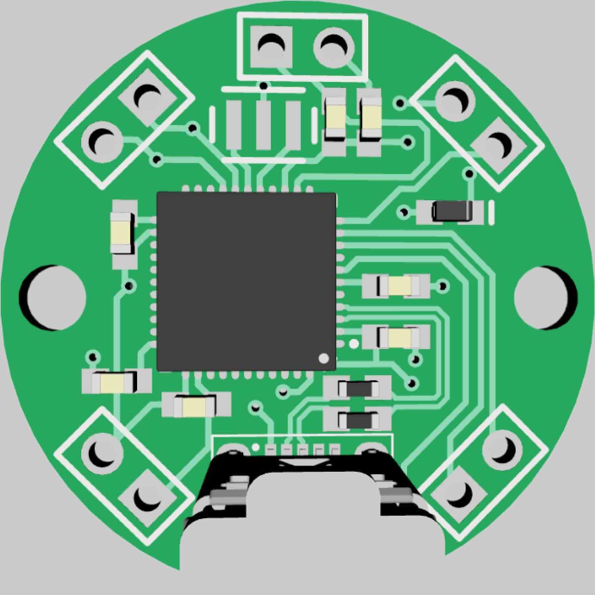
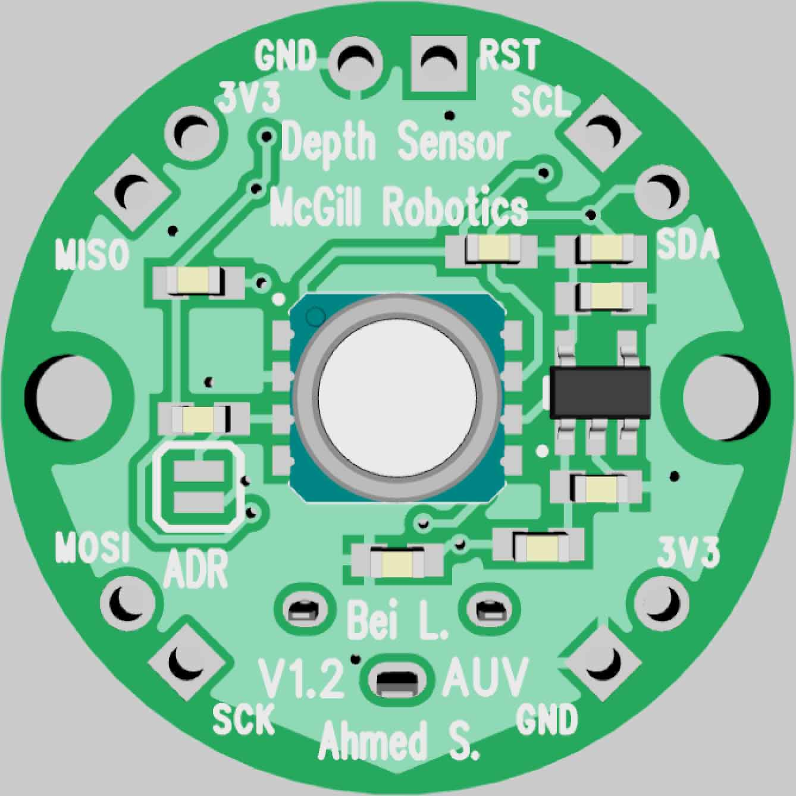
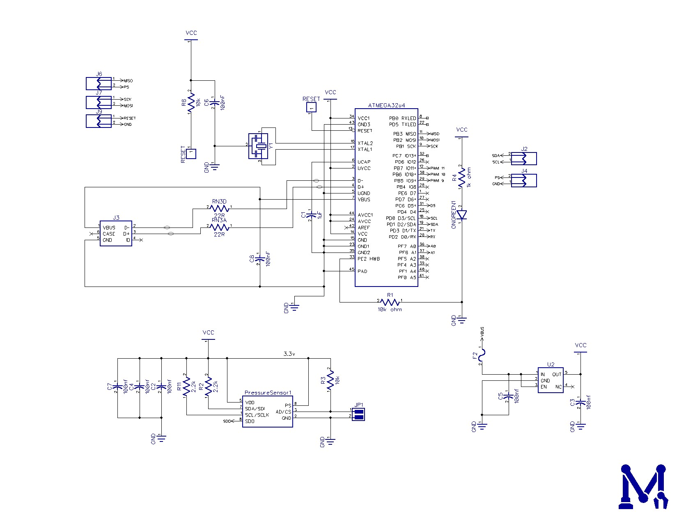
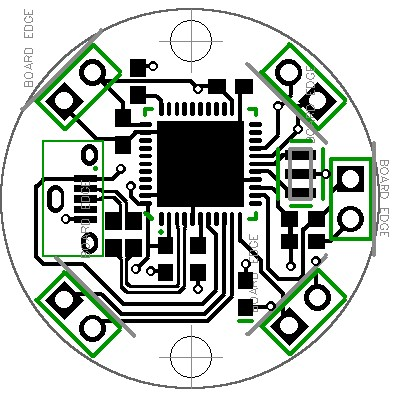
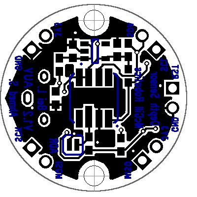

# Depth Sensor

__Author:__ Ahmed Sami, Bei Chen Liu

__Description:__ An Arduino Leonardo Clone designed to work at 3.3V with a MS5803 pressure sensor connected on the I2C bus.

__Features:__
* Arduino Compatible Board
* High resolusion pressure sensor allowing precise depth measurement 

## Changelog:

### Version 1.3
- Change the footprint for the USB connector to the correct size 

### Version 1.2.1
- Changed the oscillator in the schematic and Layout to be 8 MHz

### Version 1.2
- Remove a lot of unecessary components
- Switch to QFN for the ATmega32u4
- Made the board ciruilar and fit within 1 inch diameter

### Version 1.0
- Initial Release

## 3D Rander:
 

## Schematic:

## Layout:
 

