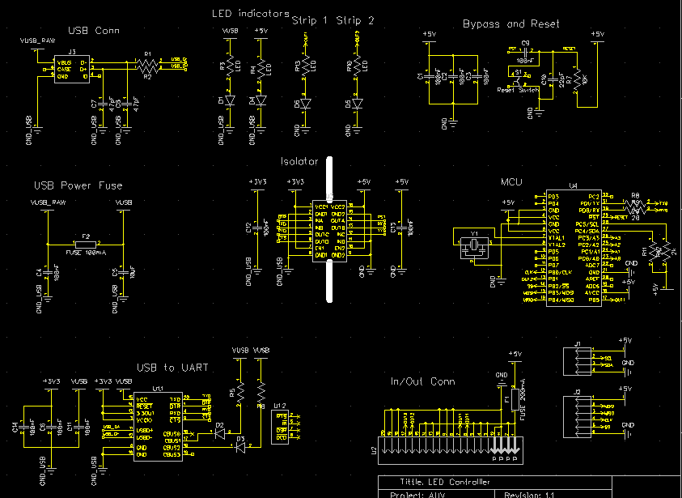

# Blinky Tape Board Atmega328P

__Author:__ Juan Morency Trudel

__Used In:__ C class 2017 AUV

__Description:__ Standalone microcontroller board using Atmega328p to control the LED strips on the AUV.

## Changelog:

### Version 1.1
- Changed the form factor to fit in the new AUV PV
- Added a board egde connector
- Added an additional digital output to control the LED strip if we want to make the 2 sides independent.
- Added SPI connector for programming

## 3D Rander:

## Schematic:
 

## Layout:
 

