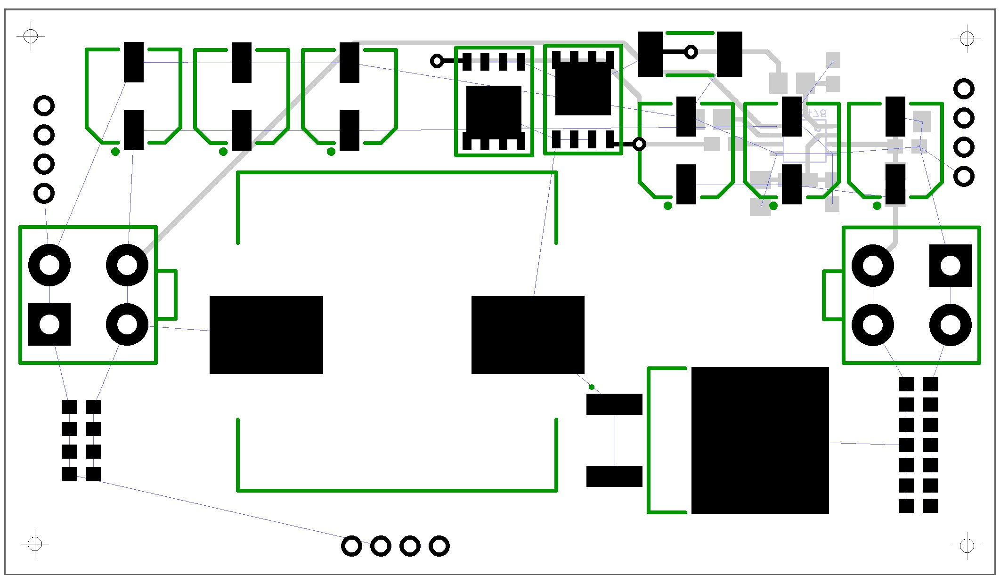
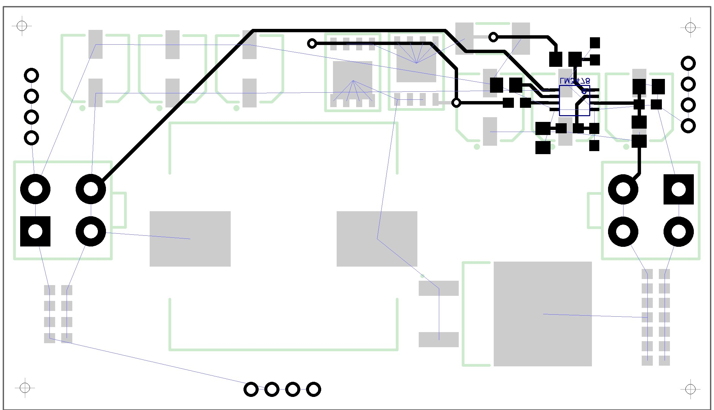

# Boost Converter

__Author:__         Jun Shin

__Description:__    Boost converter
                    
                    Vin  --> 10~14V
                    Vout --> 19.5V
                    Amp  --> 7A

__Schematic:__          

__Components:__         

__PCB Layout V1:__      

__PCB Layout V2 top:__  

__PCB Layout V2 bottom:__  

