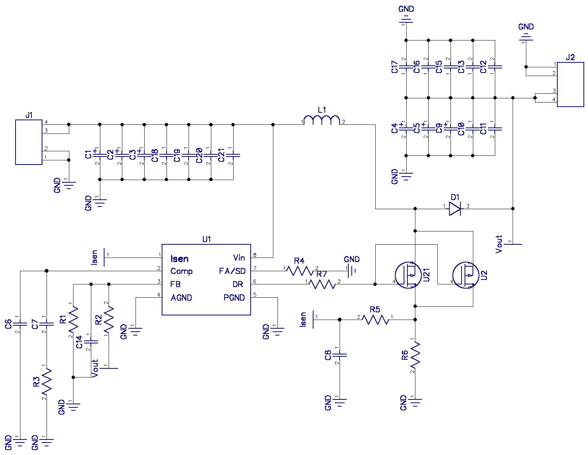

# Boost Converter

__Author:__         Jun Shin

__Description:__    Boost converter
                    
                    Vin  --> 10~14V
                    Vout --> 19.5V
                    Amp  --> 7A

__Schematic:__ 

__Components:__ 

__PCB Layout:__ 