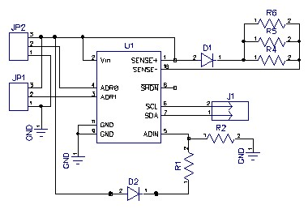

# Voltage-Current Monitor

__Author:__ Yaniv Bronshtein

__Description:__ This is an I2C Current Voltage Monitor (LTC4151CDD)

__Schematic:__ 

_Comments:_ Put resistor across Adresse line in series (0605).
            