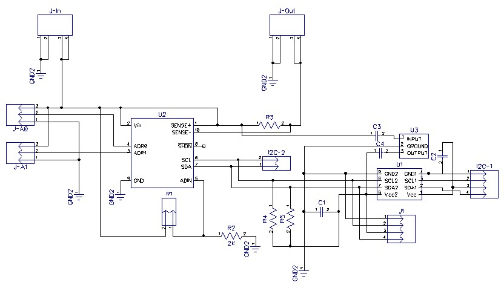

# Voltage-Current Monitor

__Authors:__ Yaniv Bronshtein, Shammamah Hossain and Kareem Halabi

__Description:__ This is a high-side I2C Current and Voltage Monitor (LTC4151CDD) connected to an I2C isolator

__Schematic:__ 

_Comments:_ Put resistor across Adresse line in series (0605).
            