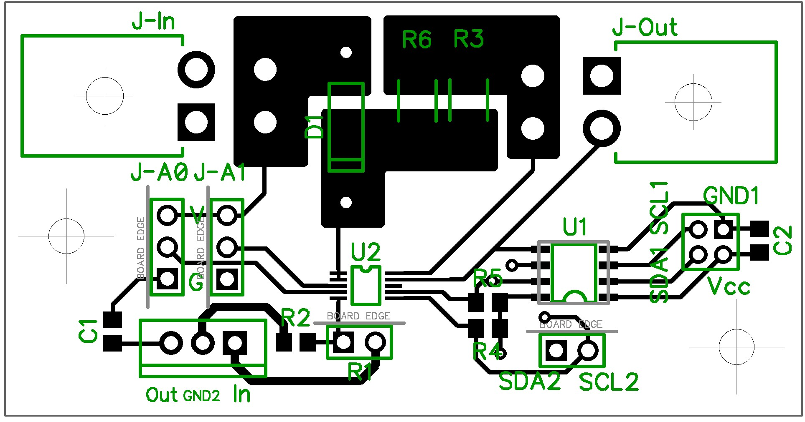
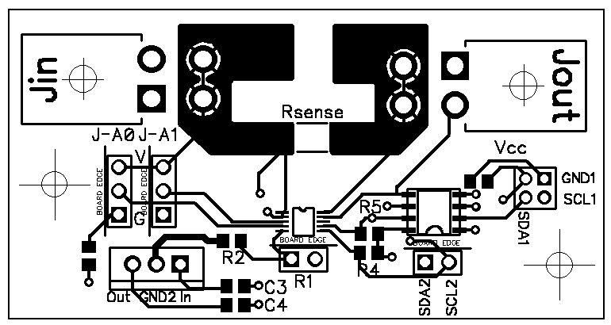

# Voltage-Current Monitor

__Authors:__ Yaniv Bronshtein, Shammamah Hossain and Kareem Halabi

__Description:__ This is a high-side I2C Current and Voltage Monitor (LTC4151CDD) connected to an I2C isolator

__Schematic:__ 

__PCB Final lay 1:__ 

__PCB Final lay 2:__ 
            